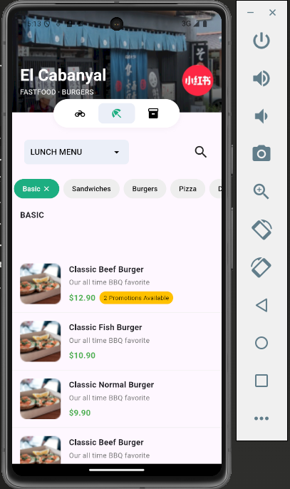
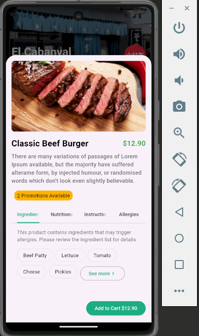

Here’s the updated `README.md` file with the correct project structure and details based on your provided folder and file structure. I’ve also included the new files and folders you mentioned:

---

# Food Ordering App

A Flutter-based food ordering application that allows users to browse menu items, view details, and explore ingredients, nutritional information, and allergy warnings. The app supports multiple order types: delivery, dine-in, and pickup.

## Features

- **Menu Categories**: Browse items by categories like Basic, Sandwiches, and Pizza.
- **Item Details**: View ingredients, nutritional info, instructions, and allergy details.
- **Interactive UI**: Tap on items to open a bottom sheet with detailed information.
- **Order Types**: Choose between delivery, dine-in, or pickup options.
- **Responsive Design**: Works seamlessly on mobile and tablet devices.

## Screenshots

  
*Home Screen with Menu Categories*

  
*Menu Item Details with Tabs*

## Project Structure

```
food-ordering-app/
├── lib/
│   ├── base/
│   │   ├── res/
│   │   │   ├── styles/
│   │   │   │   └── app_styles.dart
│   │   │   ├── media.dart
│   │   ├── widgets/
│   │   │   ├── ingredients_tab_items.dart
│   │   │   ├── menu_item_bottom_sheet.dart
│   │   │   ├── menu_item_card.dart
│   │   │   ├── menu_item_tabs.dart
│   │   │   ├── base/
│   │   │   │   ├── cover.dart
│   │   │   │   ├── custom_tab_bar.dart
│   │   │   │   ├── filter_chip.dart
│   │   │   │   └── horizontal_filter_list.dart
│   ├── data/
│   │   └── menu_data.dart
│   ├── screens/
│   │   ├── delivery_page.dart
│   │   ├── dine_in_page.dart
│   │   └── pickup_page.dart
│   ├── main.dart
├── assets/
│   ├── images/
│   │   ├── burger.png
│   │   ├── burger_cover.png
│   │   ├── logo.png
│   │   └── cover.png
│   └── screenshots/
├── pubspec.yaml
├── README.md
└── ...
```

## Getting Started

### Prerequisites

- **Flutter SDK**: Ensure Flutter is installed. Follow the [official guide](https://flutter.dev/docs/get-started/install) if needed.
- **IDE**: Use [Android Studio](https://developer.android.com/studio) or [VS Code](https://code.visualstudio.com/) with the Flutter and Dart plugins installed.

### Installation

1. **Clone the Repository**:
   ```bash
   git clone https://github.com/jisdulanjana/food_ordering_application.git
   ```

2. **Install Dependencies**:
   ```bash
   flutter pub get
   ```

3. **Run the App**:
   ```bash
   flutter run
   ```

4. **Build the App** (Optional):
   - For Android:
     ```bash
     flutter build apk
     ```
   - For iOS:
     ```bash
     flutter build ios
     ```

### Key Files and Folders

- **`lib/base/`**: Contains reusable widgets, styles, and media utilities.
  - **`res/`**: Includes `app_styles.dart` for theming and `media.dart` for media queries.
  - **`widgets/`**: Contains reusable UI components like `menu_item_card.dart`, `menu_item_bottom_sheet.dart`, and more.
  - **`base/`**: Additional base widgets like `cover.dart`, `custom_tab_bar.dart`, and `filter_chip.dart`.

- **`lib/data/`**: Contains `menu_data.dart`, which holds the menu items and categories.

- **`lib/screens/`**: Includes pages for different order types:
  - `delivery_page.dart`
  - `dine_in_page.dart`
  - `pickup_page.dart`

- **`assets/`**: Contains images and screenshots used in the app.
  - **`images/`**: Includes `burger.png`, `burger_cover.png`, `logo.png`, and `cover.png`.

### Usage

1. **Browse Menu**: Select a category from the menu bar to view available items.
2. **View Details**: Tap on a menu item to open a bottom sheet with detailed information.
3. **Explore Tabs**: Switch between tabs to view ingredients, nutritional information, instructions, and allergy details.
4. **Choose Order Type**: Navigate to `delivery_page.dart`, `dine_in_page.dart`, or `pickup_page.dart` to select your preferred order type.

### Dependencies

The project uses the following dependencies:

- **Flutter**: The core framework for building the app.
- **Material Design**: For UI components and theming.
- **Custom Styles**: Defined in `app_styles.dart` for consistent theming.

You can find all dependencies in the `pubspec.yaml` file.


